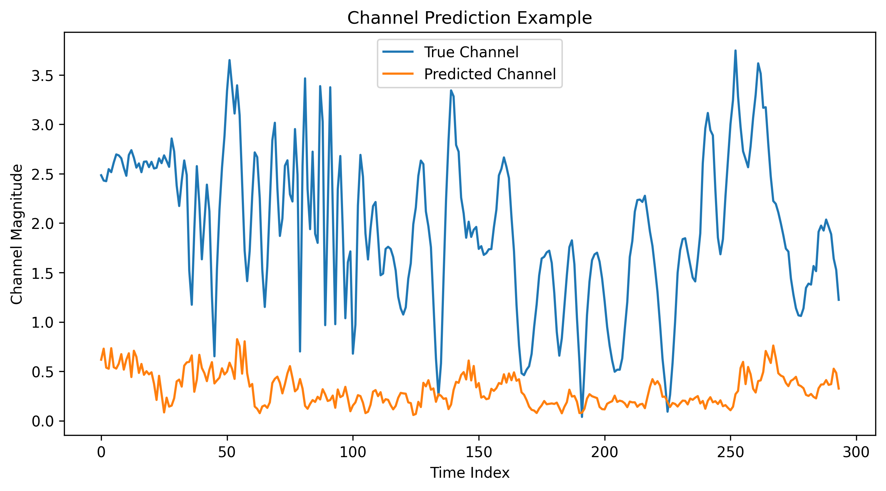
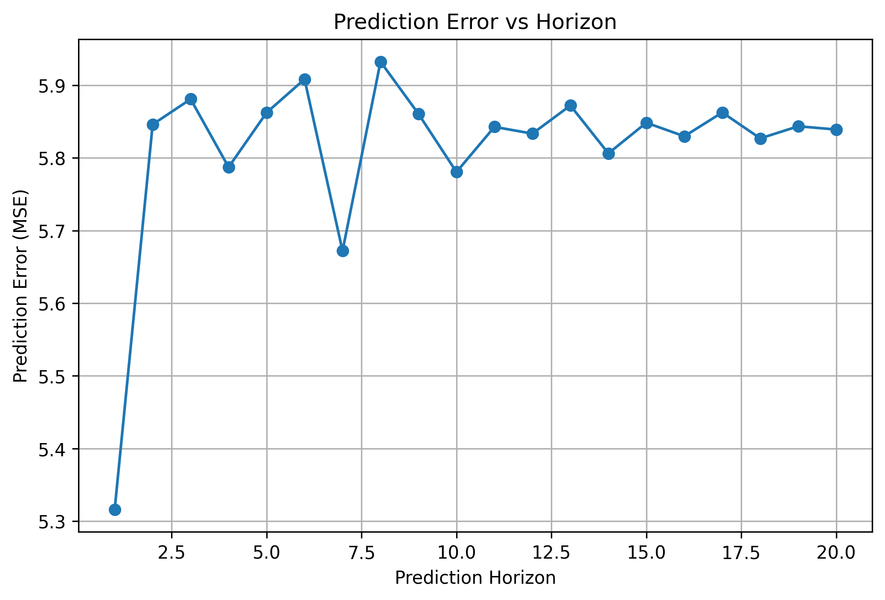
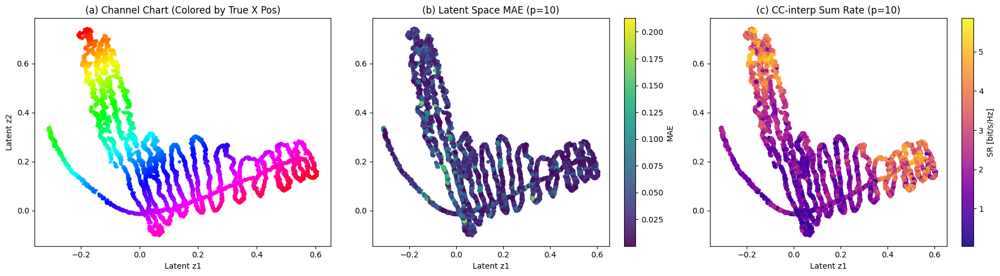
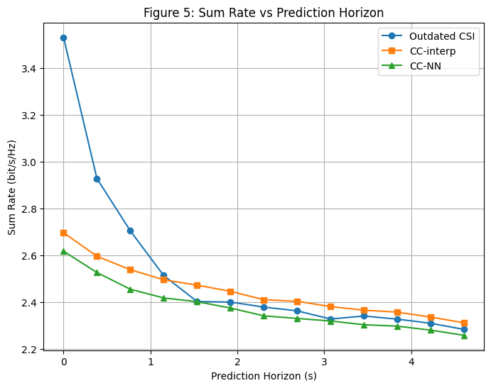

# Machine Learning for Wireless Communication Project  
## Channel Charting-Based Channel Prediction on Real-World Distributed Massive MIMO CSI

---

## 1. Problem Statement
Channel aging in massive MIMO systems degrades communication performance due to outdated Channel State Information (CSI).  
This project aims to predict future CSI using machine learning-based approaches to improve system reliability and throughput.

---

## 2. Methods Implemented

### 2.1 Wiener Predictor (Baseline)
- Predicts future CSI using past samples  
- Based on temporal correlation  
- Simple but limited in dynamic environments  

### 2.2 Channel Charting-Based Prediction
- Maps CSI to a latent space (channel chart)  
- Predicts future position in latent space  
- Recovers CSI using interpolation  

### 2.3 CSI Interpolation
- Implemented using **Delaunay triangulation**  
- Uses neighboring latent points for interpolation  
- More accurate than nearest-neighbor methods  

---

## 3. Dataset

This project uses the **DICHASUS distributed massive MIMO dataset (cf02 subset)**.

Dataset link:  
https://dichasus.inue.uni-stuttgart.de/datasets/data/dichasus-cf0x/

Note:
- Dataset is **not included** due to large size  
- Must be downloaded manually  

---

## 4. Dataset Setup

### Required Files
- project-root/data/dichasus-cf02.tfrecords
- project-root/data/spec.json

---

## 5. CSI Processing Pipeline
TFRecord Dataset
↓
Decode CSI Tensor (32 × 1024 × 2)
↓
Convert to Complex Channel (32 × 1024)
↓
Select Subcarrier
↓
Create Channel Time Sequence
↓
Prediction

---

## 6. Results

### 6.1 Wiener Prediction (Baseline)
- Captures short-term temporal correlation  
- Prediction error increases with horizon  

### 6.2 Channel Charting
- Learns spatial structure of environment  
- Enables better long-term prediction  

---

### Example Results

#### True vs Predicted Channel

#### Prediction Error vs Horizon

#### Channel Chart Visualization

#### Sum Rate vs Horizon

---

## 7. Key Observations
- Prediction error increases with prediction horizon (channel aging)  
- Wiener predictor works only for short-term prediction  
- Channel charting captures spatial consistency  
- Interpolation improves CSI estimation  
- Performance depends on latent space quality  

---

## 8. Limitations

### Implementation Limitations
- Euclidean distance used instead of geodesic distance  
- No explicit autocorrelation modeling  

### Paper Limitations
- Single-user scenario  
- Assumes slow user movement  
- Only one BS array used for downlink  
- Multi-array phase synchronization not addressed  

---

## 9. Requirements

### Required Libraries
- numpy  
- tensorflow  
- matplotlib  
- scipy  
- scikit-learn  

---

## 10. Future Work
- Implement geodesic distance in latent space  
- Improve CSI interpolation methods  
- Extend to multi-user scenarios  
- Compare with full Wiener filter implementation  

---

## 11. Authors
- Shudharshan A  
- KH Sudhir  
- R. Vaikunth  

---
  
